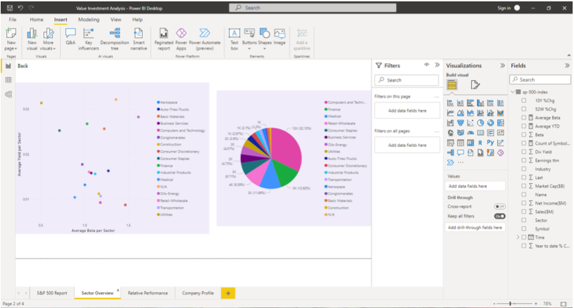
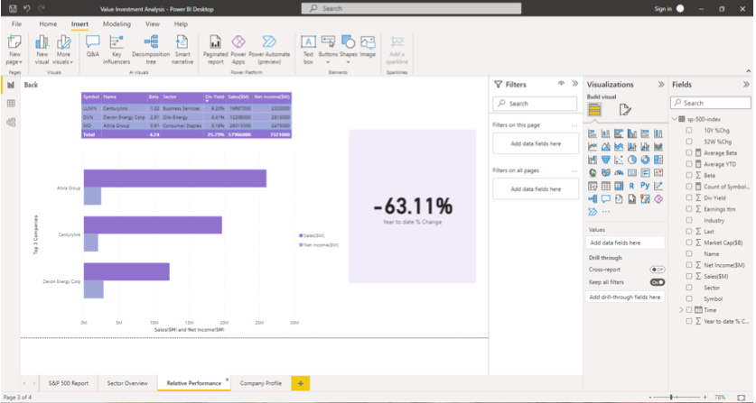
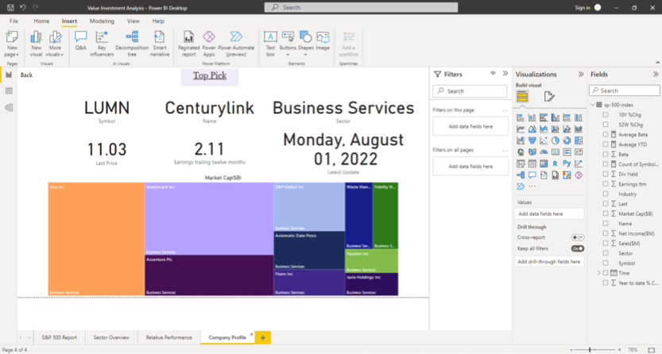

# s-p500_Value_Investment_Analysis

This repo uses data from [Barchart.com]( https://www.barchart.com):
 
The data from barchart was compiled into a csv file and uploaded into PowerBI. This data was then cleaned and properly formatted using the power query feature. 

Three pages were made in this report to help visualize the data:

## Sector Overview

This page uses visualizations to show which sector offers the most dividends (distribution of company’s earnings to shareholders) with the lowest Beta (systematic risk).

## Relative Performance

This page has visuals of the top 3 companies in the S&P 500 filtered by the highest dividend yield and a visual to show the year to date % change. As well as a clustered bar chart to show the sales and net income for the top 3 companies. 

## Company Profile

This page displays visuals for the top company filtered for the lowest beta, the highest dividend yield and the highest sales and net income. There is also a tree map for the sector this company is in filtered by market capitalization (total value of all a company’s shares of stock). 

